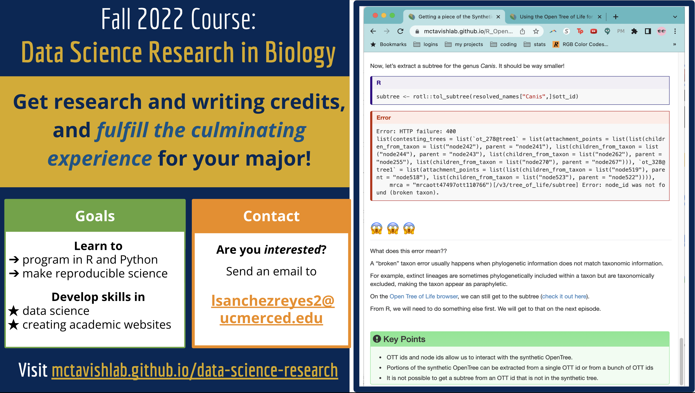

<a class="page-link" href="https://mctavishlab.github.io/GradPhylo/">QSB/ES 244 Phylogenetics</a>

   

<a href="https://mctavishlab.github.io/data-science-research/" class="boxlink">

    
    

    Data Science Research in Biology
    

</a>

Explore the course <a href="https://mctavishlab.github.io/data-science-research/">syllabus</a>.

Bio 144, Phylogenetics
Bio 141, Evolution
Bio 1, Introductory Biology
